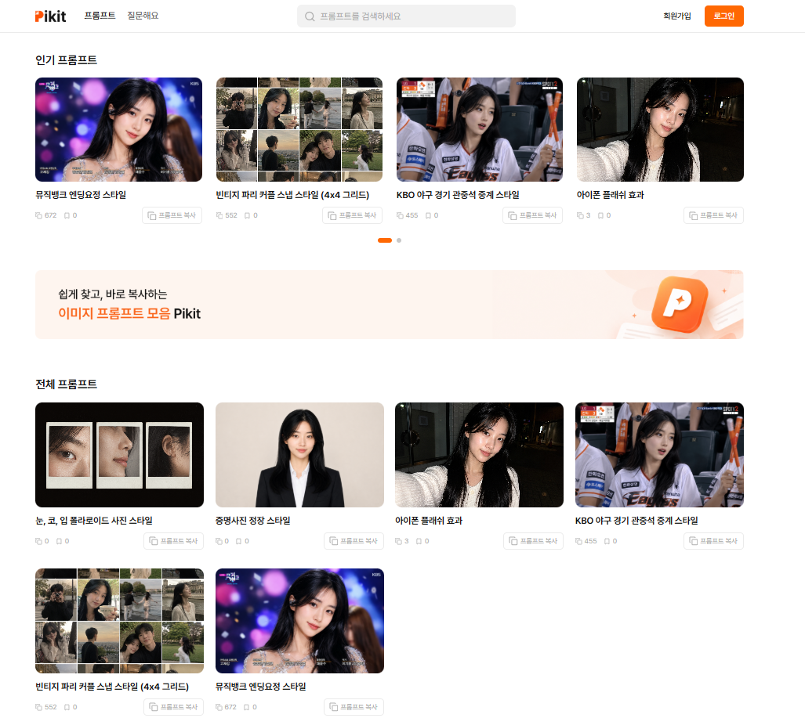
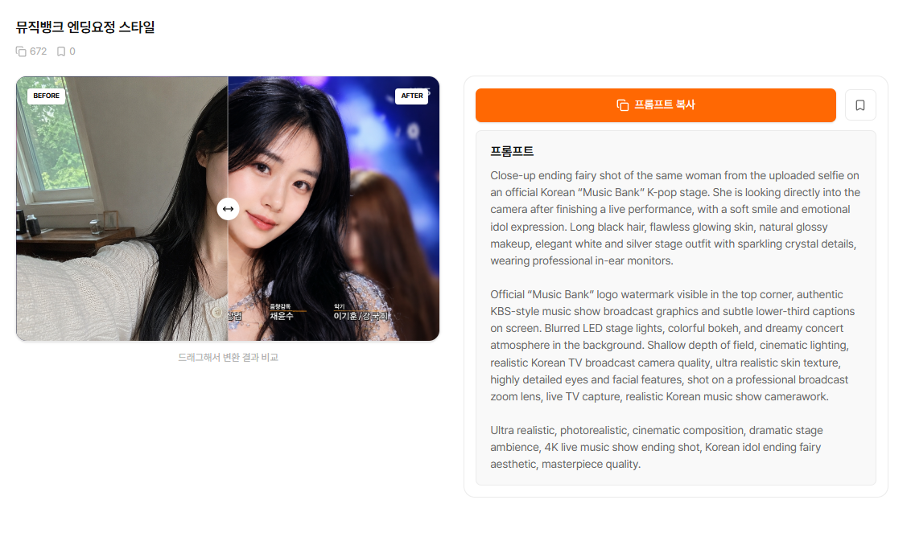

<div align="center">

# 🎨 Pikit Frontend

<p align="center">
  
  
  
  
  
</p>

<p align="center">
  <strong>AI 이미지 프롬프트 아카이브 · 프론트엔드</strong><br/>
  쉽게 찾고, 바로 복사하는 이미지 프롬프트 모음
</p>

<p align="center">
  <a href="https://pikit.life">🌐 Live</a> ·
  <a href="https://github.com/Reazon-team/Pikit_Backend">⚙️ Backend</a> ·
  <a href="#-시작하기">🚀 시작하기</a>
</p>

<br/>

<!-- 스크린샷: public/screenshots/home.png 로 저장 후 아래 경로 사용 -->


</div>

---

## 📖 소개

**Pikit**은 인기 있는 AI 이미지 프롬프트를 모아 **누구나 쉽게 보고 복사**할 수 있는 아카이브 플랫폼입니다.

크리에이터가 직접 만든 프롬프트와 결과 이미지를 한 곳에 모아두고, **Before/After 슬라이더**로 원본과 AI 변환 결과를 비교할 수 있습니다.

<br/>

## ✨ 주요 기능

### 🎯 사용자 기능
- 🖼️ **프롬프트 갤러리** — 인기 캐러셀 + 전체 그리드 + 페이지네이션
- 🔀 **Before/After 슬라이더** — 원본과 AI 변환 결과 인터랙티브 비교
- 📋 **원클릭 프롬프트 복사** — 카드 hover 시 즉시 복사 버튼
- 🔐 **인증 시스템** — JWT 기반 회원가입/로그인, "로그인 유지" 옵션
- ❤️ **좋아요·북마크** — 마음에 드는 프롬프트 저장
- 📊 **정렬** — 최신순 / 인기순 (복사 횟수 기준)

### 🛠 관리자 기능 (`/admin/prompts`)
- 프롬프트 등록·수정·삭제
- **이미지 직접 업로드** (Cloudflare R2 연동, 최대 10MB)
- 노출 여부(가시성) 토글
- 페이지네이션된 관리 테이블

### 🎨 디자인 시스템
- **라이트 테마** + **오렌지 포인트 컬러 `#FF6803`**
- **Pretendard** 단일 폰트로 깔끔한 한글 타이포그래피
- **반응형 레이아웃** (모바일 2열 → 태블릿 3열 → 데스크탑 4열 그리드)

<br/>

## 🛠 기술 스택

| 분야 | 기술 |
|---|---|
| **Framework** | Next.js 16.2.5 (App Router, Static Export) |
| **Language** | TypeScript |
| **Styling** | Tailwind CSS v4 |
| **State** | Zustand (Persist + 커스텀 Storage Adapter) |
| **HTTP** | Fetch API + 자동 토큰 갱신 클라이언트 |
| **Icons** | Lucide React |
| **Deploy** | Cloudflare Pages (무료, 자동 배포) |

<br/>

## 🖼️ 스크린샷

<!-- 스크린샷 추가 가이드:
     아래 4개 자리에 캡처한 PNG를 ./public/screenshots/ 에 저장하고 경로 맞추기.
     이미지 가로 폭은 900px 정도 추천. -->

<table>
  <tr>
    <td align="center"><strong>홈화면</strong></td>
    <td align="center"><strong>상세 페이지 (Before/After)</strong></td>
  </tr>
  <tr>
    <td></td>
  </tr>
  <tr>
    <td></td>
  </tr>
</table>

<br/>

## 📁 프로젝트 구조

```text
Pikit_Frontend/
├── src/
│   ├── app/                    # Next.js App Router (페이지)
│   │   ├── page.tsx            # 홈 (인기 캐러셀 + 그리드)
│   │   ├── prompts/detail/     # 프롬프트 상세 (?id= 쿼리)
│   │   ├── admin/prompts/      # 관리자 페이지
│   │   ├── login/, signup/, qa/
│   ├── components/             # UI 컴포넌트
│   │   ├── cards/PromptCard.tsx
│   │   ├── admin/PromptFormModal.tsx
│   │   └── ... (Header, Footer, Slider 등)
│   ├── store/                  # Zustand 스토어 (authStore 등)
│   ├── lib/                    # API 클라이언트, 유틸
│   └── types/                  # 공통 타입
├── public/
│   ├── screenshots/            # README 스크린샷
│   └── _redirects              # Cloudflare SPA 폴백
├── next.config.ts              # output: 'export'
└── package.json
```

<br/>

## 🚀 시작하기

### 사전 요구사항
- Node.js 20+
- npm

### 설치 및 실행

```bash
# 1. 클론
git clone https://github.com/Reazon-team/Pikit_Frontend.git
cd Pikit_Frontend

# 2. 의존성
npm install

# 3. 환경변수
echo "NEXT_PUBLIC_API_URL=http://localhost:8080" > .env.local

# 4. 개발 서버
npm run dev
```

### 사용 가능한 스크립트

```bash
npm run dev       # 개발 서버 (Turbopack)
npm run build     # 정적 빌드 → out/ 디렉토리 생성
npm run start     # 빌드 결과 서빙
npm run lint      # ESLint
```

<br/>

## 🌐 배포

`main` 브랜치 푸시 시 **Cloudflare Pages**가 자동 빌드·배포.

| 항목 | 값 |
|---|---|
| Build command | `npx next build` |
| Build output | `out` |
| Framework preset | `Next.js (Static HTML Export)` |
| Environment | `NEXT_PUBLIC_API_URL` (백엔드 URL) |

상세 페이지는 **쿼리 파라미터 방식** (`/prompts/detail?id=`)을 사용해 Static Export 환경에서도 빌드 후 새로 등록된 프롬프트까지 즉시 접근 가능합니다.

<br/>

## 🎨 디자인 시스템

| 토큰 | 값 |
|---|---|
| Primary | `#FF6803` (오렌지) |
| Primary Light | `#FFC89A` |
| Background | `#FFFFFF` / `#F8F8F8` |
| Line | `#E9E9E9` |
| Text Primary | `#171717` |
| Text Gray | `#8B8B8B` |
| Danger | `#E53A36` |
| Font | Pretendard (CDN) |

<br/>

## 🤝 연관 리포지토리

- ⚙️ [Pikit Backend (Spring Boot)](https://github.com/Reazon-team/Pikit_Backend)